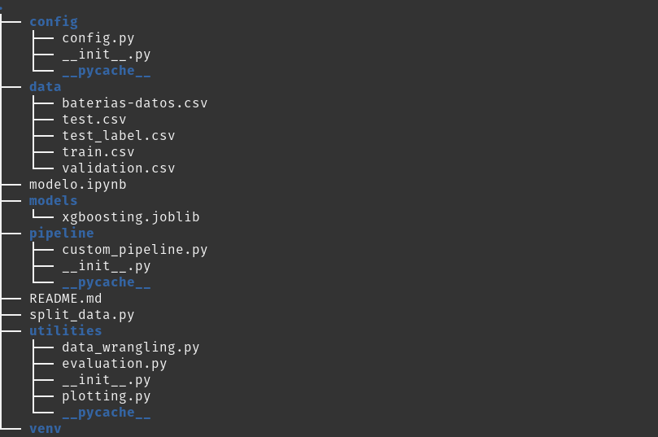
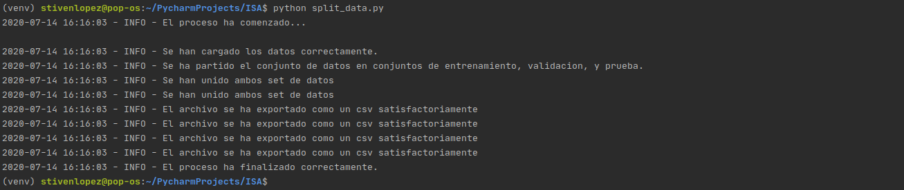

# ISA - prueba técnica

El siguiente proyecto tiene como objetivo la construcción de un modelo o algoritmo de Machine Learning con el fin de automatizar la detección de fallos en baterías.

El esquema del proyecto es el siguiente:

## Instrucciones

Lo primero que se hace es partir el set de datos, en datos de entrenamiento, validación y prueba, por un lado los de entrenamiento para entrenar el modelo, los de validación para optimizar los hiperparametros basado en los datos de validación y los datos de prueba para evaluar el rendimiento del modelo.

Para hacer lo anterior, se ejecuta el siguiente código en la terminal donde se tenga el proyecto:

    `python split_data.py`
    
El código anterior produce la siguiente salida:

Después de haber partido los datos, se procede a explorar los datos, entrenar y evaluar el modelo en el notebook modelo.ipynb.

## Estructura

* La carpeta `config` tiene instanciadas algunas variables que se usan para explorar los datos, y entrenar los modelos en un archivo `config.py`.
* La carpeta `data` contiene los archivos csv con los datos originales, y después de haber particionado.
* La carpeta `models` contiene el modelo serializado que se entrena en `modelo.ipynb`.
* La carpeta `pipeline` contiene un archivo `custom_pipeline.py` con una clase que selecciona columnas de un DataFrame, esta clase hereda de algunas clases de scikit-learn para poder realizar la transformación en un objeto pipeline.
* La carpeta `utilities` contiene diferentes archivos con funciones creadas para manipulación de datos, y visualización, adicional de un archivo con una clase para evaluar el desempeño del modelo.
* Finalmente el archivo `split_data.py` que particiona los datos y `modelo.ipynb` donde se hace la exploración, entrenamiento y evaluación del modelo, y un archivo html derivado del notebook.

El proyecto está organizado para mantener la reproducibilidad.